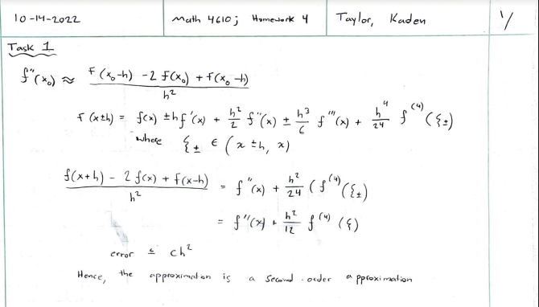
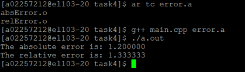

# Math 4610 - Tasksheet 4 - Kaden Taylor A02257212

## Task 1


## Task 2
Here is the code for task 2:
```python
import math as m

x0 = m.pi / 4


def f_function(x):
    return ((x-(m.pi/2))*m.tan(x)*m.tan(x)) / (x*x + 65)


def fprime(f, x0, h):
    top = f(x0 + h) - 2*f(x0) + f(x0-h)
    bottom = h*h
    return top / bottom


for i in range(1, 10):
    h = 1 / 10**i
    result = fprime(f_function, x0, h)
    print(f"With h = {h} the approximation is: {result}")
```

When this code is ran, the follow results are given:
```
With h = 0.1 the approximation is: -0.06870934574899934
With h = 0.01 the approximation is: -0.06768784722816987
With h = 0.001 the approximation is: -0.06767779469826762
With h = 0.0001 the approximation is: -0.06767769435145343
With h = 1e-05 the approximation is: -0.06767775576066447
With h = 1e-06 the approximation is: -0.0676819711387111
With h = 1e-07 the approximation is: -0.0685215773010839
With h = 1e-08 the approximation is: -0.13877787807814454
With h = 1e-09 the approximation is: -3.4694469519536137
```

## Task 3
Here is my code for task 3:
```python
x = [1.0, 2.0, 3.0, 4.0, 5.0, 6.0, 7.0, 8.0, 9.0]
y = [.5, 1.0, 1.5, 2.0, 3.0, 3.0, 3.5, 4.5, 5.0, 5.5]

n = len(x)

a11 = n + 1
a12 = x[0]
a22 = x[0] ** 2
b1 = y[0]
b2 = x[0] * y[0]
for i in range(1, n):
    a12 = a12 + x[i]
    a22 = a22 + (x[i] ** 2)
    b1 = b1 + y[i]
    b2 = b2 + (x[i] * y[i])
a21 = a12

detA = (a11 * a22) - (a12 * a21)
b = ((a22 * b1) - (a12*b2)) / detA
a = ((a11 * b2) - (a21 * b1)) / detA

print(f"The value of a is: {a} \nThe value of b is: {b} \nThe equation is: {a}x + {b}")
```

Here are the results when this code is ran:
```
The value of a is: 0.5515151515151515
The value of b is: -0.08181818181818182
The equation is: 0.5515151515151515x + -0.08181818181818182
```

## Task 4
Here is my code for my `main.cpp` file:
```
#include <stdio.h>
#include <stdlib.h>

#include "absError.cpp"
#include "relError.cpp"

int main()
{
  float v = 2.1;
  float u = 0.9;

  float absolute = absError(v, u);
  float relative = relError(v, u);

  printf("The absolute error is: %f\n", absolute);
  printf("The relative error is: %f\n", relative);

  return 1;
}
```

Here is my code for my `absError.cpp` file:
```
#include <math.h>

float absError(float v, float u)
{
  float error;
  error = fabs(u-v);
  return error;
}
```

Here is my code for my `relError.cpp` file:
```
#include <math.h>

float relError(float v, float u)
{
  float error;
  error = fabs(u-v)/fabs(u);
  return error;
}
```

When my main file is compiled and ran, these are the results that I get:
```
The absolute error is: 1.200000
The relative error is: 1.333333
```

Below is a screen shot illustration the creation of a shared library and its use:
* 

## Task 5
Here is my code for task 5:
```python
h = .1
a = 2.0
b = .0005
P0 = 10.0
P = P0
end_t = 100


def dPdt(a, b, P):
    return a*P - b*P*P


for i in range(0, int(end_t/h)):
    P1 = P + h*dPdt(a, b, P)
    P = P1
    print(f"P = {P}")
```

When this code is run, these are the results that I get:
```
P = 11.995000000000001
P = 14.38680599875
P = 17.25381818915772
P = 20.689697114884037
P = 24.806233359525564
P = 29.736712570756314
P = 35.63984148118179
P = 42.70429986237796
P = 51.153976973516755
P = 61.253935900209754
P = 73.31712084708835
P = 87.71177500604068
P = 104.8694622335133
P = 125.29347447475865
P = 149.56724663241255
P = 178.362177895635
P = 212.4439601495783
P = 252.67613036929217
P = 300.01909510023063
P = 355.52234124903873
P = 420.3070027424866
P = 495.5355044632653
P = 582.3648335467352
P = 681.8803602884864
P = 795.0083910588259
P = 922.408152177894
P = 1064.3479426532608
P = 1220.5757040324015
P = 1390.2005923751722
P = 1571.6078264981927
P = 1762.4318337823127
P = 1959.609902102311
P = 2159.5283341019017
P = 2358.255869632835
P = 2551.838506226516
P = 2736.6122193788005
P = 2909.482341291892
P = 3068.124434835803
P = 3211.079944421138
P = 3337.7442128321827
P = 3448.2662338838827
P = 3543.3924796734723
P = 3624.289462357841
P = 3692.373649481505
P = 3749.1672210085376
P = 3796.187922656001
P = 3834.873369981237
P = 3866.5353557879216
P = 3892.3376440676043
P = 3913.290556109838
P = 3930.2565185048834
P = 3943.9620071433537
P = 3955.0125928825128
P = 3963.9088809660525
P = 3971.0619763291857
P = 3976.80771060265
P = 3981.4192743677454
P = 3985.118157325945
P = 3988.0834523986873
P = 3990.459661713613
P = 3992.3631784681593
P = 3993.887626722372
P = 3995.108233322543
P = 3996.085390188973
P = 3996.86754594268
P = 3997.493546140723
P = 3997.994522797031
P = 3998.3954171406845
P = 3998.71620497824
P = 3998.972881576109
P = 3999.1782525122744
P = 3999.342568246373
P = 3999.474032986273
P = 3999.5792125569533
P = 3999.663361192459
P = 3999.730683287683
P = 3999.784543003572
P = 3999.8276320817718
P = 3999.8621041798824
P = 3999.889682393143
P = 3999.9117453060157
P = 3999.929395855368
P = 3999.943516435047
P = 3999.954812988518
P = 3999.963850288721
P = 3999.9710801656365
P = 3999.9768640906914
P = 3999.9814912457896
P = 3999.9851929795027
P = 3999.9881543726397
P = 3999.9905234910957
P = 3999.992418788386
P = 3999.993935027835
P = 3999.995148020429
P = 3999.996118415166
P = 3999.9968947313796
P = 3999.9975157846216
P = 3999.9980126273886
P = 3999.9984101017135
P = 3999.9987280812443
P = 3999.9989824649147
P = 3999.99918597188
P = 3999.9993487774705
P = 3999.9994790219553
P = 3999.9995832175505
P = 3999.999666574032
P = 3999.9997332592197
P = 3999.9997866073722
P = 3999.9998292858954
P = 3999.999863428715
P = 3999.999890742971
P = 3999.999912594376
P = 3999.9999300755003
P = 3999.9999440604
P = 3999.99995524832
P = 3999.999964198656
P = 3999.999971358925
P = 3999.99997708714
P = 3999.999981669712
P = 3999.9999853357695
P = 3999.9999882686157
P = 3999.9999906148923
P = 3999.999992491914
P = 3999.999993993531
P = 3999.999995194825
P = 3999.9999961558597
P = 3999.999996924688
P = 3999.9999975397504
P = 3999.9999980318003
P = 3999.99999842544
P = 3999.999998740352
P = 3999.9999989922817
P = 3999.9999991938253
P = 3999.99999935506
P = 3999.999999484048
P = 3999.9999995872386
P = 3999.9999996697907
P = 3999.9999997358327
P = 3999.999999788666
P = 3999.999999830933
P = 3999.9999998647463
P = 3999.999999891797
P = 3999.9999999134375
P = 3999.99999993075
P = 3999.9999999446
P = 3999.99999995568
P = 3999.999999964544
P = 3999.999999971635
P = 3999.999999977308
P = 3999.9999999818465
P = 3999.999999985477
P = 3999.9999999883817
P = 3999.9999999907054
P = 3999.9999999925644
P = 3999.9999999940514
P = 3999.999999995241
P = 3999.999999996193
P = 3999.999999996954
P = 3999.9999999975635
P = 3999.9999999980505
P = 3999.99999999844
P = 3999.999999998752
P = 3999.999999999002
P = 3999.9999999992015
P = 3999.999999999361
P = 3999.999999999489
P = 3999.999999999591
P = 3999.999999999673
P = 3999.9999999997385
P = 3999.999999999791
P = 3999.9999999998327
P = 3999.9999999998663
P = 3999.999999999893
P = 3999.9999999999145
P = 3999.9999999999313
P = 3999.999999999945
P = 3999.999999999956
P = 3999.9999999999645
P = 3999.999999999972
P = 3999.9999999999773
P = 3999.999999999982
P = 3999.9999999999854
P = 3999.999999999988
P = 3999.9999999999905
P = 3999.9999999999923
P = 3999.9999999999936
P = 3999.999999999995
P = 3999.999999999996
P = 3999.999999999997
P = 3999.9999999999973
P = 3999.9999999999977
P = 3999.999999999998
P = 3999.9999999999986
P = 3999.999999999999
P = 3999.999999999999
P = 3999.999999999999
P = 3999.999999999999
P = 3999.999999999999
P = 3999.999999999999
```
