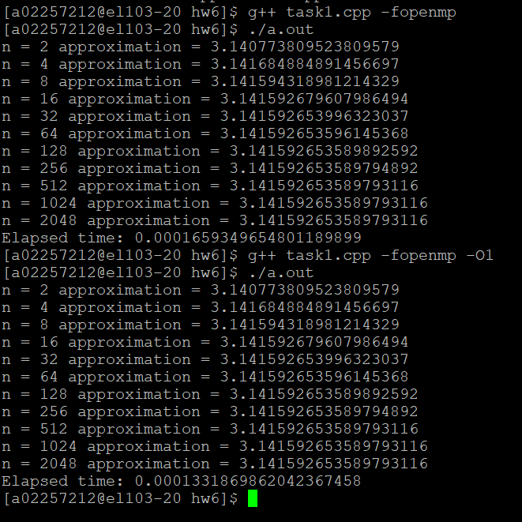

# Tasksheet 6: Kaden Taylor - A02257212

## Task 1. Computing an Approximation of pi.

## Task 2. The Code.

```c++
#include <stdio.h>
#include <stdlib.h>
#include <iostream>

#include <omp.h>

using namespace std;

double f(double);
double simpson(double (double), double, double, int);

int main()
{
  double start = omp_get_wtime();
  double end;

  double a = 0.0;
  double b = 1.0;
  int n[] = {2, 4, 8, 16, 32, 64, 128, 256, 512, 1024, 2048};
  int nlen = 11;

  cout.precision(19);
  for(int i = 0; i < nlen; i++)
    {
      double twentytwo7s = 22.0/7.0;
      double approx = -1 * (simpson(&f, a, b, n[i]) - twentytwo7s);
      cout << "n = " << n[i] << " approximation = " << approx << endl;
    }

  end = omp_get_wtime();

  cout << "Elapsed time: " << end - start << endl;

  return 1;
}


double f(double x)
{
  return ((x*x*x*x)*((1-x)*(1-x)*(1-x)*(1-x))) / (1 + (x*x));
}

double simpson(double (*func)(double), double a, double b, int n)
{
  double h = (b - a) / n;
  double k = 0.0;
  double x = a + h;

  for(int i = 1; i < int(n/2 + 1); i++)
    {
      k += 4*func(x);
      x += 2*h;
    }

  x = a + 2 * h;

  for(int i = 1; i < int(n / 2); i++)
    {
      k += 2 * func(x);
      x += 2 * h;
    }

  return (h /3)*(func(a) + func(b) + k);
}
```
